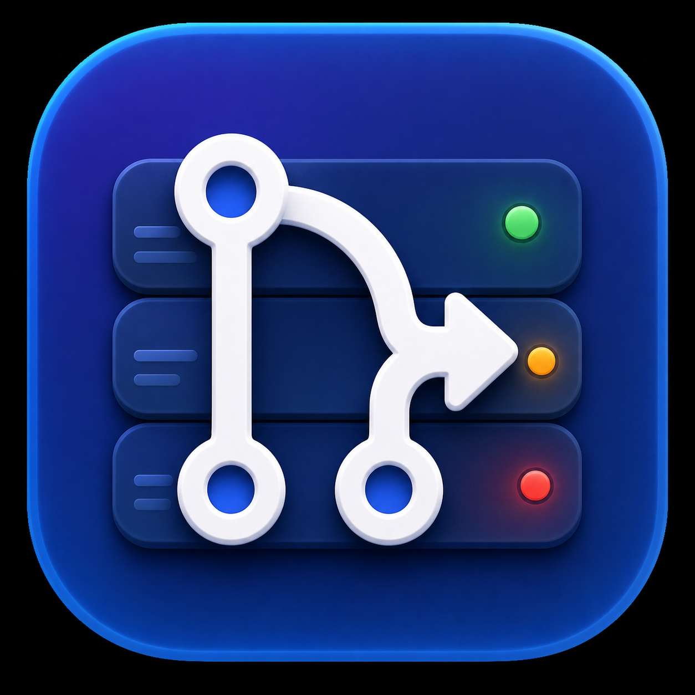

# prWatcher

<p align="center">
  
</p>

prWatcher is a compact native macOS dashboard for the GitHub pull requests that need your attention. It lives comfortably in a corner of the display, talks to GitHub through your existing `gh` CLI login, and keeps useful results visible even when GitHub—or your network—is unavailable.

Current version: **0.2.0**

Created by **Kristopher Linquist**.

## Pull request sections

The built-in dashboard sections are:

- **Watched** — PRs explicitly added by URL or with **Watch This PR** from any PR’s context menu, including PRs viewed under a teammate. Watched PRs always belong to your **Me** view.
- **Assigned to me** — PRs authored by someone else where you are assigned or requested as a reviewer. A setting controls whether team review requests are included.
- **Failing CI** — open, non-draft PRs with failing checks or merge conflicts.
- **Ready to merge** — open PRs with the required approvals, passing checks, and no merge conflict.
- **Waiting for CI** — PRs whose checks are still pending.
- **Waiting for review** — PRs that still need approval.
- **Drafts** — your authored draft PRs.
- **Merged** — your recently merged PRs, ordered by merge time.

Sections with no results are hidden automatically. Every section is collapsible, and its collapsed state is remembered between launches. In **Settings → Edit Sections**, sections can be reordered or disabled entirely; disabled sections are not queried.

## Monitoring your team

Add teammates by GitHub username in Settings. When at least one teammate is configured, a person picker appears in the main window and uses the person’s GitHub display name when available.

- Your **Me** results continue refreshing at the configured interval in the background.
- Selecting a teammate performs a one-time refresh of that person’s authored PRs.
- Switching back to **Me** uses the continuously maintained cache instead of launching another refresh.
- The selected organization filter is global: teammate results are restricted to that same organization.

## Watched pull requests

Use the eye toolbar button to paste a GitHub pull-request URL, or right-click any displayed PR and choose **Watch This PR**. Right-click a watched PR and choose **Stop Watching** to remove it.

Watching and unwatching update the Watched section immediately without refreshing every PR. prWatcher stores each watched PR’s last-known details, so the section remains visible during refreshes and after relaunch; the row updates when its current GitHub status arrives. Status changes are highlighted, badged when the section is collapsed, and eligible for notifications.

## Custom sections

Create custom sections in Settings with a name, color, and GitHub search query. `is:pr` is implied, and a PR may appear in both a custom section and a built-in section.

Before saving a query, you can:

- **Check Query** to see the number of matching results.
- Open the same query on GitHub to inspect the exact matches.

For example:

```text
is:open team-review-requested:example/web -author:octocat -reviewed-by:hubot draft:false
```

Custom sections appear under **Me**, refresh automatically, participate in unread highlighting and notifications, and can be reordered or disabled in **Edit Sections**.

## Actions and automation

Right-click a PR to copy its GitHub link, open it in the browser, or watch/unwatch it. When GitHub reports that your account has permission, the menu also offers the applicable management actions:

- Close the pull request.
- Convert it to a draft or mark it ready for review.
- Enable or cancel **Merge When Ready**.

A permission-aware **Merge** button appears on PRs that are ready. **Merge When Ready** remembers the request and automatically merges after a later poll observes that the PR has moved from waiting/failing/draft into the ready state, then sends a notification. The automation can be canceled from the context menu.

## Refreshing, caching, and offline behavior

- The refresh interval is configurable in Settings and defaults to three minutes.
- GitHub calls use `gh api graphql`, so prWatcher uses your existing GitHub CLI authentication.
- Built-in categories use separate, bounded API calls to avoid oversized shared requests.
- Results appear progressively as calls complete, while existing rows stay visible to prevent layout jumps.
- Previous results remain on screen when an individual category fails.
- Transient GitHub 502/503/504 gateway errors are retried and summarized without discarding cached data.
- macOS network monitoring pauses polling while offline, shows **Offline — refresh paused**, suppresses raw socket errors, and performs an immediate refresh when connectivity returns.
- The lower-right status displays **Refreshing…** or a minute-rounded **Last updated** age.
- Clicking that status opens a live refresh log with copy and clear controls.

## Notifications and unread results

prWatcher can notify when a PR first appears in a tracked section, changes section, or changes watched/custom status. Newly discovered or changed rows are highlighted. The first click marks a highlighted row as read instead of opening it, and collapsed sections show an unread badge.

macOS Focus and notification settings still control whether alerts are delivered. Notifications require the bundled `.app`; they are disabled when running the Swift Package executable directly.

## Window and display

- Starts at approximately 400 × 900 points near the upper-right of the screen.
- Remains fully resizable.
- Can stay above other apps with **Keep window above other apps** in Settings.
- Shows each PR’s relative opened time, rounded to the minute.
- Shows the GitHub author on PRs not authored by the signed-in user, including Watched, Custom, Assigned, and teammate rows.
- Includes a native app icon and a quiet, non-animated refresh status.

## Requirements

- macOS 14 or later
- Xcode 16 or later / Swift 6
- [GitHub CLI](https://cli.github.com/) authenticated with `gh auth login`

Confirm GitHub CLI access with:

```sh
gh auth status
```

## Build and run

Open the native project in Xcode:

```sh
open prWatcher.xcodeproj
```

Select the `prWatcher` scheme and **My Mac**, then click Run.

Alternatively, build an ad-hoc signed app bundle and install it into `~/Applications`. The script stops the currently running app, replaces it, and relaunches the new build:

```sh
./scripts/build-app.sh
```

The staged bundle remains at `dist/prWatcher.app`. You can also run the Swift Package executable for development:

```sh
swift run prWatcher
```

Run the test suite with:

```sh
swift test
```

## Distribution

Another Mac can run a copied `prWatcher.app`, but an ad-hoc signed build may trigger Gatekeeper warnings. For broad distribution, sign with a Developer ID certificate and notarize the app with Apple.

## Versioning

prWatcher follows Semantic Versioning. The current user-facing version is recorded in `VERSION`, `support/Info.plist`, and the Xcode target’s `MARKETING_VERSION`; the build number is recorded as `CFBundleVersion` and `CURRENT_PROJECT_VERSION`. Release notes live in [CHANGELOG.md](CHANGELOG.md), and releases are tagged as `vMAJOR.MINOR.PATCH`.
